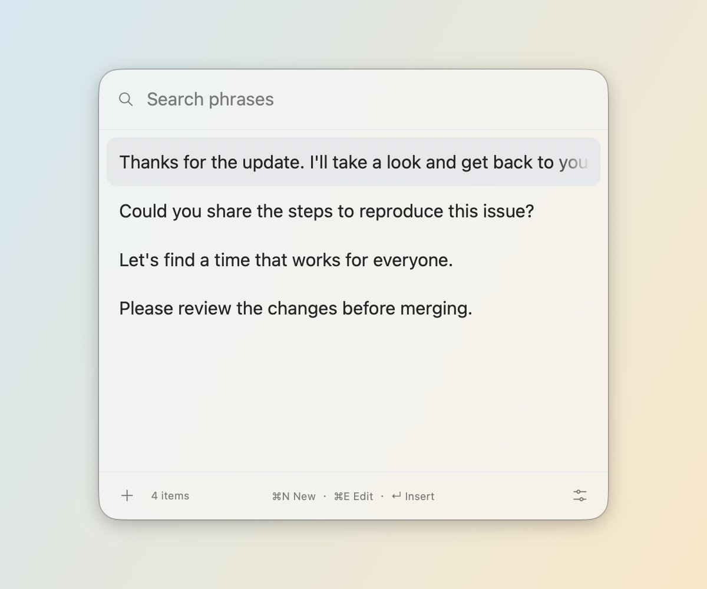
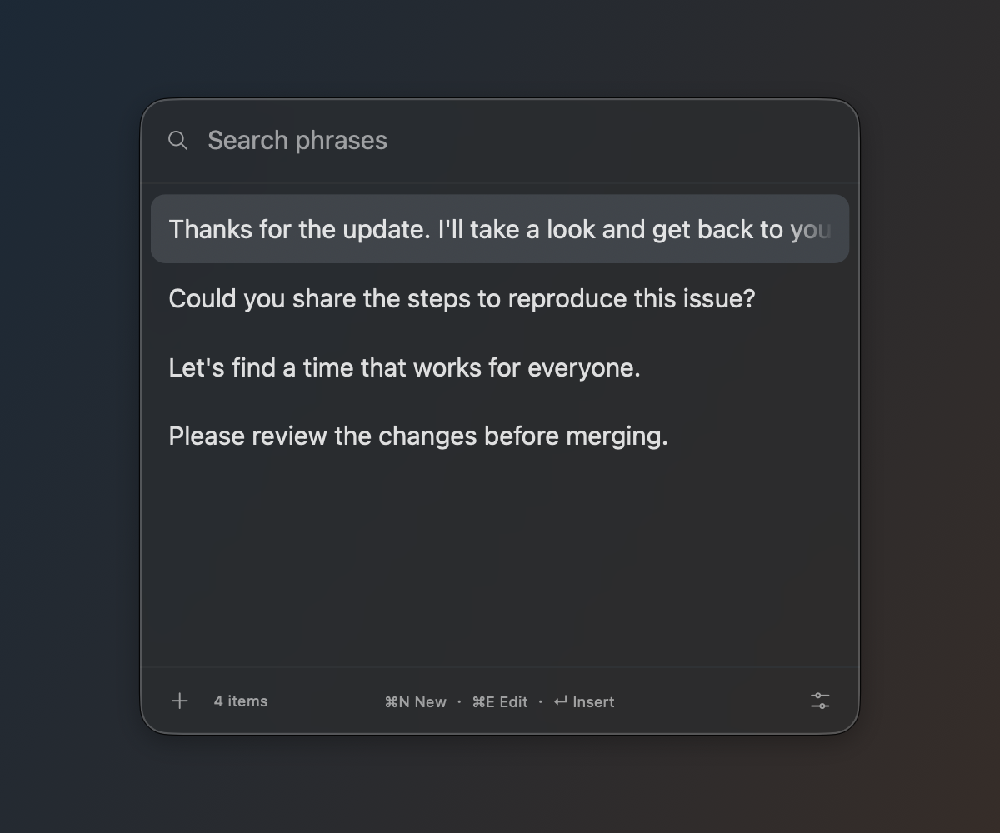

<p align="center">
  
</p>
<h1 align="center">Popeste</h1>
<p align="center">Your everyday phrases, a keystroke away.</p>
<p align="center">English · <a href="README.zh-CN.md">简体中文</a></p>

<p align="center">
  
  
</p>

*Native macOS 26 floating windows with sample phrases, using the app’s glass container and controls. Glass appearance varies with the background and system settings.*

Popeste is a native macOS menu bar utility for the text you type over and over: replies, snippets, notes, and reusable phrases. Bring up the search bar, find an item, and press Return to insert it into your current app.

No account, cloud service, or network connection required.

## Features

- **A compact floating picker.** Starts as a search bar and expands when you type or press ↓. Appears above the text cursor when available, with a mouse-position fallback.
- **Your text, preserved.** Store multiline text, indentation, Unicode, and emoji. Search the full body, pin frequent items, and edit in the same window.
- **Keyboard navigation.** Choose arrow keys, Emacs, Vim, or a combination. Optional Vim editing supports normal/insert modes, visual-line movement, and undo.
- **Native macOS appearance.** Built with Swift and AppKit. Three sizes, light/dark appearance, and frosted or liquid glass on macOS 26+.
- **Local storage.** Phrases and preferences live in `~/.config/popeste`, with atomic writes and protection against overwriting invalid data.
- **Eight interface languages.** English, Simplified Chinese, Traditional Chinese, Japanese, Korean, French, German, and Spanish. Follows the system language by default.

## Install with Homebrew

The first release is an **unnotarized test build** for Apple Silicon Macs running macOS 14+. macOS 14–15 device testing is still pending.

```sh
brew tap archcst/tap
brew install --cask popeste
```

This build is ad-hoc signed, not Developer ID signed or notarized by Apple. Homebrew installs it but does not bypass Gatekeeper. If macOS blocks the first launch, review the download source and use **System Settings → Privacy & Security → Open Anyway** if offered. You do not need to disable Gatekeeper globally.

You can also download the ZIP from [GitHub Releases](https://github.com/archcst/popeste/releases). To update, run `brew upgrade --cask popeste`; to uninstall, run `brew uninstall --cask popeste`. Your files in `~/.config/popeste` are retained.

## Build from source

Requirements:

- macOS 14 or later to run.
- Swift tooling with the macOS 26 SDK or newer to build.
- Node.js only if you want to run the retained JavaScript regression tests.

```sh
git clone https://github.com/archcst/popeste.git
cd popeste
./scripts/build-app.sh
open dist/Popaste.app
```

The build creates an app for your Mac's architecture and applies an ad-hoc signature. The executable and bundle are currently named `Popaste`. The test release uses this ad-hoc signature; a fully trusted distribution needs Developer ID signing and notarization.

## Quick start

1. Open the app and grant **Accessibility** access from Settings to enable insertion into other apps.
2. Add a phrase with **⌘N**.
3. Focus a text field in another app and press **⌃⌥Space**, the default global shortcut.
4. Type to search, use **↑ / ↓** to choose an item, and press **Return** to insert it.

The app pastes text without sending Return or submitting the target form. You can change the global shortcut in Settings. Without Accessibility permission, phrase management and manual copying remain available.

| Shortcut | Action |
| --- | --- |
| ⌃⌥Space | Show or hide the picker (customizable) |
| ⌘N | New phrase |
| ⌘E | Edit the selected phrase |
| ⌘, | Settings |
| ⌘S | Save the editor |
| ⌘⇧C | Copy the selected phrase |
| Return | Insert the selected phrase |
| Esc | Go back or dismiss; confirm unsaved edits when leaving the editor |

When enabled, Emacs navigation uses **⌃N/P/F/B** and Vim navigation uses **⌃J/K/L/H** for next, previous, preview, and back. Vim editing is a separate, optional setting. In the unsaved-changes dialog, **Return** saves, **N** discards, and **Esc** returns to editing.

Chinese input composition does not trigger filtering until the text is committed. Losing focus hides the picker while preserving the current draft.

## Data and permissions

All app-managed preferences and phrases are stored in **`~/.config/popeste`**:

| File | Contents |
| --- | --- |
| `config.json` | Shortcut, appearance, language, size, navigation, and other preferences |
| `prompts.json` | Phrase bodies, IDs, pin status, usage counts, and timestamps |
| `migration-v1-backup.json` | Original phrase data saved during legacy migration, when applicable |

Files use `0600` permissions and atomic writes. Existing files take precedence over legacy data; invalid data is reported instead of silently overwritten. Quit the app before editing these files manually. Use **Settings → Configuration file → Open** to reveal the folder.

macOS manages Accessibility permission and login items. Accessibility is used to locate the text cursor and send ⌘V. Cursor geometry depends on the target app: some controls expose only their input-area bounds or no usable position at all, so placement may be approximate or fall back to the mouse.

The clipboard is restored after 800 ms only if it has not changed in the meantime. Apps that read the clipboard slowly or use custom input controls may need manual copying. Changing development signatures can require granting Accessibility access again.

## Compatibility

- **macOS 14–15:** opaque native interface; glass settings are hidden. Actual device testing is still pending.
- **macOS 26+:** frosted and liquid glass options, with an opaque fallback when Reduce Transparency is enabled.
- Set `POPASTE_GLASS=0` at launch to use the opaque fallback.
- The current build script targets the host architecture, not a Universal binary.

See [validation notes](VALIDATION.md) for tested behavior and remaining manual checks.

## Development

```sh
./scripts/test.sh                   # Storage, configuration, native UI, and JS regressions
./scripts/render-native-preview.sh  # Native UI fixtures across sizes and appearances
./scripts/render-readme.sh          # Bilingual screenshots with isolated sample data
```

The running app uses Swift, AppKit, and TextKit. HTML files in `design/` are visual references and are not bundled into the app. Logo sources and the app icon are in [`assets/`](assets/).
