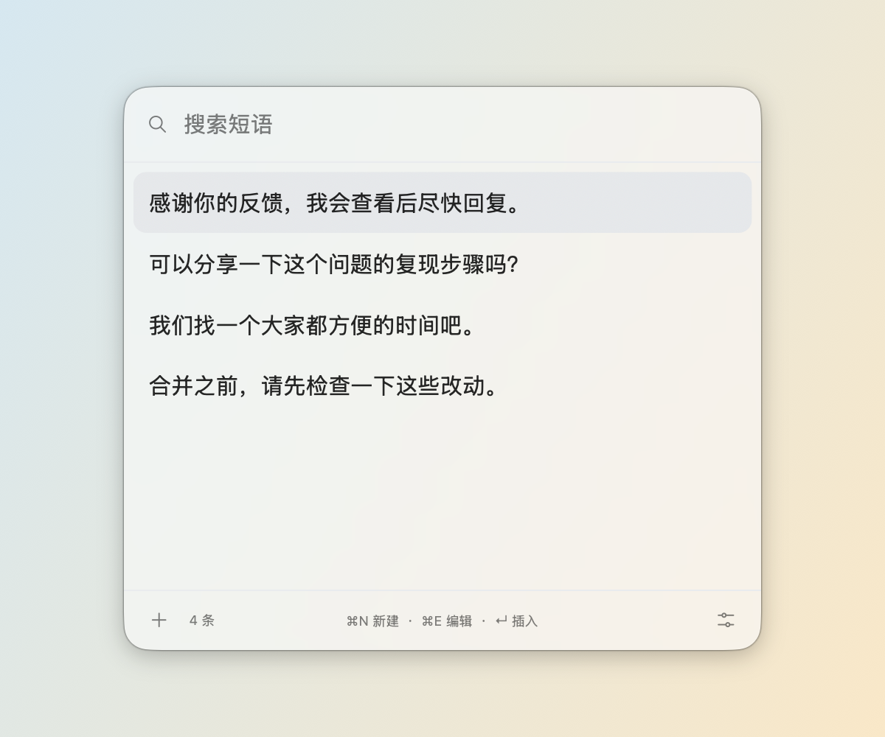
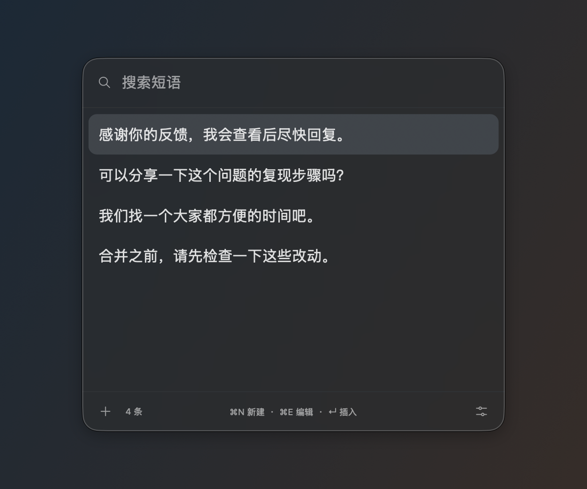

<p align="center">
  
</p>
<h1 align="center">Popeste</h1>
<p align="center">常用短语，随手即用。</p>
<p align="center"><a href="README.md">English</a> · 简体中文</p>

<p align="center">
  
  
</p>

*以上为 macOS 26 原生浮窗截图，使用应用的玻璃容器、控件和示例短语；玻璃效果随背景和系统设置变化。*

macOS 菜单栏短语工具，支持 macOS 14+。每条短语保存完整正文，列表用正文开头辨认内容，长内容单行裁切。无需账号、网络或第三方依赖。

## Homebrew 安装

首个版本为 **未公证测试版**，支持 Apple Silicon、macOS 14+；macOS 14、15 的实机兼容性仍待验证。

```sh
brew tap archcst/tap
brew install --cask popeste
```

安装包采用临时签名，没有 Developer ID 签名和 Apple 公证。Homebrew 负责安装，但不会绕过 Gatekeeper。如果首次打开被拦截，请确认下载来源，再通过「系统设置 → 隐私与安全 → 仍要打开」（若系统提供）允许运行，无需全局关闭安全检查。

也可以从 [GitHub Releases](https://github.com/archcst/popeste/releases) 下载 ZIP。更新使用 `brew upgrade --cask popeste`，卸载使用 `brew uninstall --cask popeste`；卸载保留 `~/.config/popeste` 中的数据。

## 源码构建与运行

```sh
scripts/build-app.sh
open dist/Popaste.app
```

界面完全使用 Swift + AppKit 实现：搜索、列表、设置和确认框为原生控件，正文编辑与预览使用 NSTextView / TextKit。菜单栏、全局快捷键、系统权限及插入同样由 Swift 实现。HTML 设计稿保留为视觉参考，不参与应用构建或运行。

使用包含 macOS 26 或更新 SDK 的 Swift / Command Line Tools 构建本机架构的应用，运行最低要求为 macOS 14。开发构建使用 ad-hoc 签名；测试版使用临时签名；完整的受信任分发仍需 Developer ID 签名与公证。

```sh
scripts/test.sh
```

8 组独立 Swift 测试覆盖数据、导入导出、迁移、配置持久化、编辑草稿和屏幕位置。无需 XCTest 或完整 Xcode。原生 AppKit 测试覆盖 Unicode 光标、撤销、Vim 行操作、真实 TextKit 折行和保存确认状态。另保留 21 项设计稿 JavaScript 回归测试，运行这些参考测试需安装 Node.js。

可运行 `scripts/render-native-preview.sh` 生成三档大小、浅深色下六个页面状态的原生预览，输出位于 `.build/ui-review`。预览使用独立示例数据。

## 使用

- 全局快捷键呼出或收起浮窗；设置中可录制。首次默认 Control+Option+Space，迁移时保留已有组合。
- 列表默认只显示搜索框，输入已上屏内容后展开；↓（启用 Emacs 方案时也可用 Ctrl+N）展开全部短语并选中第一条。清空搜索保持展开，下次呼出列表时收起。⌘N 和 ⌘, 可直接进入新建和设置。
- 直接输入搜索正文；中文组词期间保持结果，选字上屏后筛选。置顶优先，然后按使用次数、更新时间排序。
- 设置中复选快捷键方案：默认只启用 ↑ ↓ ← →；Emacs 用 Ctrl+N/P 选择、Ctrl+F 预览、Ctrl+B 返回；Vim 用 Ctrl+J/K 选择、Ctrl+L 预览、Ctrl+H 返回。三项可组合启用，勾选状态与按键提示同步更新。Enter 插入、Esc 取消；正文编辑与中文组词保留原有输入行为。
- 列表每行是一条短语的正文。双击插入；浮窗中 Command+Shift+C 复制所选正文。
- 一个浮窗内完成搜索、新建、编辑、置顶和确认删除。底栏提供新建、条目数和设置入口；Command+N 新建、Command+E 编辑选中项、Command+, 进入设置；每行右侧的编辑按钮浮在正文上层，在悬停时显示，Command+S 保存正文并回到列表。
- 点击外部、切换应用或失去键盘焦点时自动收起浮窗，保留当前编辑草稿；主动离开有修改的编辑页时提示保存或丢弃（回车保存、N 丢弃、Esc 返回编辑），退出程序时可选择保存、继续编辑或放弃。
- 设置页提供快捷键、三档大小、外观、语言、登录启动、权限与配置目录入口。语言默认跟随系统，支持简体中文、繁體中文、English、日本語、한국어、Français、Deutsch 和 Español，切换即时生效并保存。系统语言按偏好顺序匹配，均不支持时使用英语。整个浮窗同步缩放：小 384×339.2、中 432×381.6、大 480×424 点；空间不足时自适应屏幕边界。
- Command+1 回到短语列表，Command+, 在浮窗中打开设置。菜单栏始终提供呼出、管理、设置和退出入口。
- “Vim 编辑模式”独立开关默认关闭。开启后从普通模式开始：h/l 左右移动，j/k 按显示行上下移动（包括自动折行），i/a/I/A 输入，o/O 新建行，dd 删除行、yy 复制行、p/P 粘贴行，x 删除字符、u 撤销、Ctrl+R 重做，支持移动和整行操作的数字次数。输入模式中的 Esc 返回普通模式；普通模式的 Esc 退出编辑，有修改时显示保存确认。⌘S 始终保存。
- 关闭窗口后继续常驻。仅粘贴正文，不发送 Enter、不提交表单。

## 本地文件

用户指定的数据目录为 **`~/.config/popeste`**（目录名按指定拼写）。

| 文件 | 内容 |
| --- | --- |
| `config.json` | 全局快捷键、浮窗大小、首次使用标记、登录启动偏好、外观、玻璃样式、语言、快捷键方案、Vim 编辑模式 |
| `prompts.json` | 正文、ID、置顶、使用次数、更新时间；版本 2 |
| `migration-v1-backup.json` | 首次迁移时保存的原版短语文件 |

文件以原子方式写入，权限为 `0600`。首次启动时，若新位置尚无短语文件，自动从 `~/Library/Application Support/Popaste/prompts.json` 迁移；若尚无配置文件，从旧版 UserDefaults 读取快捷键和首次使用标记。新文件存在时优先读取，旧数据保留作恢复来源。损坏数据会报错，不静默覆盖。

设置中的“配置文件”显示目录路径，点击“打开”在访达中查看配置和短语文件。

系统权限和登录项由 macOS 管理，其余上述应用配置均从 `config.json` 读写。手工编辑文件请先退出应用。

## 权限与兼容性

macOS 14、15 使用普通实色界面，并隐藏“玻璃样式”选项。macOS 26+ 可选择“磨砂玻璃”或“液态玻璃”，即时生效并自动保存。启动时若开启系统“减少透明度”或设置 `POPASTE_GLASS=0`，同样使用实色界面并隐藏该选项，已保存的样式偏好保持不变。

辅助功能用于读取光标附近的位置和模拟 Command+V。浮窗优先出现在光标上方并向上展开；上方空间不足时回退下方。无法取得光标位置时回退鼠标附近；缺少授权时可以继续管理和复制。开发构建更换签名后，若系统开关开启但应用仍未获授权，可移除旧的辅助功能条目后重新添加当前应用。

剪贴板在发送 Command+V 后等待 800ms，再仅在 changeCount 未变化时恢复此前可读取的内容。外部应用是否接受粘贴、何时读取剪贴板没有通用确认机制；自绘控件或慢速应用可选择手动复制。

获取光标的精度取决于目标应用提供的辅助功能信息；部分输入框可能只提供整个区域的位置。

目前提供源码构建和未公证测试安装包。当前构建生成本机架构；macOS 14、15 的实机兼容性仍待验证。

实际验收范围见 [VALIDATION.md](VALIDATION.md)。设计稿位于 [design/popaste-compact-preview.html](design/popaste-compact-preview.html)。
